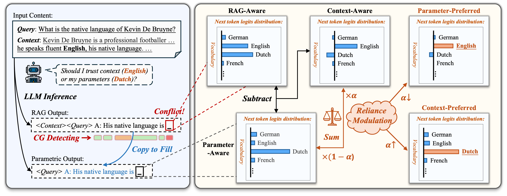

Parameters vs. Context: Fine-Grained Control of Knowledge Reliance in Language Models
===

[](https://arxiv.org/abs/2503.15888)
[](https://github.com/huggingface/transformers)

Code for the paper "Parameters vs. Context: Fine-Grained Control of Knowledge Reliance in Language Models"

Paper: https://arxiv.org/abs/2503.15888

Authors: [Baolong Bi](https://byronbbl.github.io/) $^{1}$, [Shenghua Liu](https://shenghua-liu.github.io/) $^{1}$, [Yiwei Wang](https://wangywust.github.io/) $^{2}$, Yilong Xu $^{1}$, Junfeng Fang $^{3}$, Lingrui Mei $^{1}$, Xueqi Cheng $^{1}$

$^1$ University of Chinese Academy of Sciences, $^2$ University of California, Merced, $^3$ National University of Singapore  

## Overview


Retrieval-Augmented Generation (RAG) mitigates hallucinations in Large Language Models (LLMs) by integrating external knowledge.
However, conflicts between parametric knowledge and retrieved context pose challenges, particularly when retrieved information is unreliable or the model's internal knowledge is outdated. 
In such cases, LLMs struggle to determine whether to rely more on their own parameters or the conflicted context.
To address this, we propose **CK-PLUG**, a plug-and-play method for controlling LLMs' reliance on parametric and contextual knowledge. 
We introduce a novel knowledge consistency metric, ***Confidence Gain***, which detects knowledge conflicts by measuring entropy shifts in token probability distributions after context insertion.
CK-PLUG then enables fine-grained control over knowledge preference by adjusting the probability distribution of tokens with negative confidence gain through a single tuning parameter.
Experiments demonstrate CK-PLUG's ability to significantly regulate knowledge reliance in counterfactual RAG scenarios while maintaining generation fluency and knowledge accuracy.
For instance, on LLaMA-3-8B, memory recall (MR) of RAG response can be adjusted within a broad range (9.9\%-71.9\%), compared to the baseline of 42.1\%.
Moreover, CK-PLUG supports adaptive control based on the model's confidence in both internal and external knowledge, achieving consistent performance improvements across various general RAG tasks. 




## Experiments

Run the **knowledge reliance evaluation** on the NQ, ConFiQA and MQuAKE using the following command:  

```bash
python evaluation.py --model_name ./model_path --data_path ./ConFiQA/ConFiQA-QA.json --output_path ./result/output.json
python evaluation.py --model_name ./model_path --data_path ./ConFiQA/ConFiQA-QA.json --output_path ./result/output.json
python evaluation.py --model_name ./model_path --data_path ./ConFiQA/ConFiQA-QA.json --output_path ./result/output.json
```


## Bugs or Qustions?

If you have any questions related to the repo or the paper, or you encounter any problems when using the datasets/code, feel free to email Baolong Bi (bibaolong23z@ict.ac.cn) or open an issue!

## Citation

Please cite our paper if it's helpful to your work!
```bibtex
@article{bi2025parameters,
  title={Parameters vs. Context: Fine-Grained Control of Knowledge Reliance in Language Models},
  author={Bi, Baolong and Liu, Shenghua and Wang, Yiwei and Xu, Yilong and Fang, Junfeng and Mei, Lingrui and Cheng, Xueqi},
  journal={arXiv preprint arXiv:2503.15888},
  year={2025}
}
```
